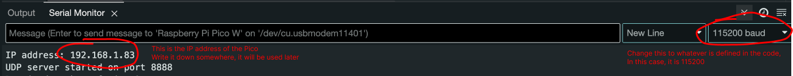

# UDP Communication

## Tutorial
### Simple
- File used: `udp_receive.ino` | `udp_send.py`
- Arduino: Update the `udp_receive.ino` file with your WiFi name (SSID) and password. Once you've made the changes, upload the code to the Pico board.
    ```
    const char* ssid = "MY_WIFI_NAME";          // WiFi network name (SSID)
    const char* password = "MY_WIFI_PASSWORD";    // WiFi network password
    ```

    - After connecting, open the serial monitor. You should see an output similar to the image below. Take note of the provided IP address, as it will be needed later. Also, make sure to adjust the baud rate to match the one specified in the Arduino code—115200 in our case.
     
- Python: Update the `server_ip = "192.168.1.83"` in the `udp_send.py` file with the IP address obtained from the Pico board, so the Python script knows where to send the message.
    - After that, run the Python script, type anything into the terminal, and you should see the corresponding output appear on the Arduino serial monitor.

### Advance
- File used: `udp_send_receive.ino` | `udp_send_receive.py`
- Arduino: Follow the same steps as described in the tutorial above, but in addition, update the IP address of the host machine (where you are running your Python code) in the `udp_send_receive.ino` file by replacing `IPAddress remoteIp(192, 168, 1, 176)`; with the IP address of your host machine. This ensures the Pico knows where to send the message.
    - In this example, we'll set up a push button to trigger the sending of messages to the Python script, and an LED to respond to the message received from the Python side. You can refer to the wiring diagram from the `button` example to properly connect the push button and LED to your Pico board.
- Python: On the Python side, follow the same steps as before: update the server_ip in the udp_send.py file with the IP from the Pico board, run the script, and verify the communication on the Arduino serial monitor.